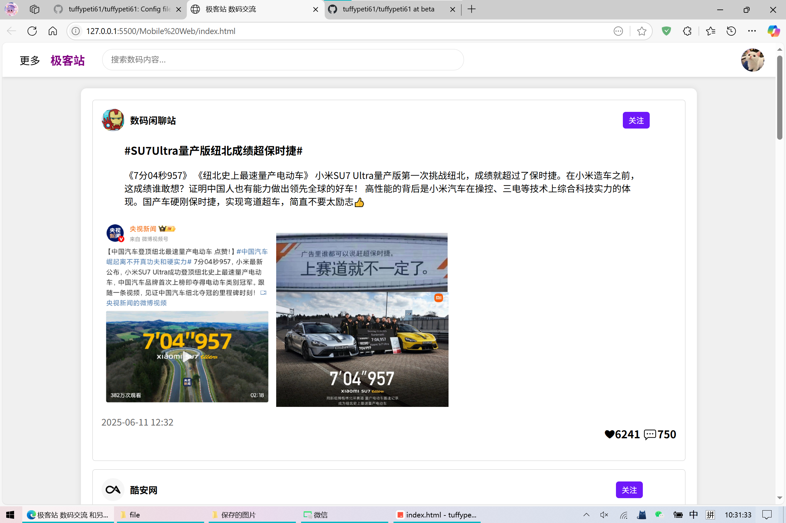

- 👋 Hi, I’m @tuffypeti61
- 这是我的学校实战作业项目，公开项目可转载分享
<!---
tuffypeti61/tuffypeti61 is a ✨ special ✨ repository because its `README.md` (this file) appears on your GitHub profile.
You can click the Preview link to take a look at your changes.
--->

<h1>Mobile Web</h1>
针对于桌面端和移动端双端的微博客  
使用传统基础的html js css 

 
<h1>VueTEST</h1>
存放于vue课程作业项目 并不熟练vue暂存
 
<h1>Web</h1>
存放于web课程作业项目 通常为字体修改 功能效果展示和css美化展示

